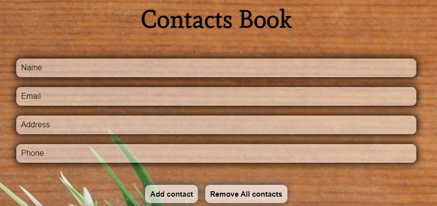
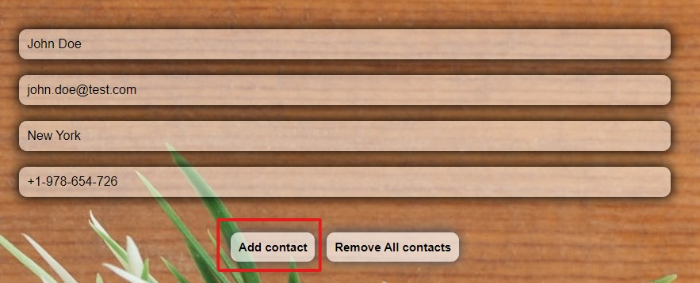

# Contacts Book App 

#### Web-приложение телефонной книги. В приложении можно создавать записи Контактов с указанием их Имени, Телефона, Email и Адреса. Есть возможность редактирования и удаления конкретной записи и очистка всей телефонной книги. В приложении реализован функционал локального хранения записей. Для наполнения контентом телефонной книги добавлена функция доступа к Fake API и отрисовка базовых записей в телефонной книге. При желании их можно удалить. 

## Общий вид приложения

## Функционал

- Добавление записи в Телефонную Книгу (записи добавлются после нажатия на кнопку "Add contact")

    

- Редактирование отдельной Записи (кнопка "Edit" под конкретной записью)

    

    После завершения редактирования можно сохранить изменения (кнопка "Save")

    

    или отменить внесённые изменения (кнопка "Cancel")

    

- Удаление одной Записи (кнопка "Remove")

    

- Очистка всей Телефонной Книги

    

## Стек технологий

- HTML
- CSS
- JavaScript